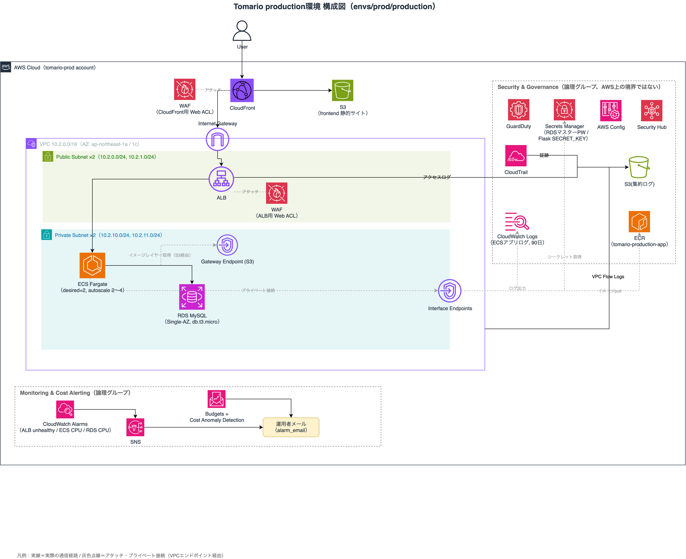

# tomario-infra

ホテル予約システム「Tomario」の AWS インフラを管理する Terraform リポジトリです。
dev（開発）・staging（負荷試験・障害試験）・production（本番）の3環境をAWSアカウント分離し、staging で検証した構成をそのまま production に適用しています。

## ディレクトリ構成

```
.
├── envs/
│   ├── nonprod/
│   │   ├── dev/       … 開発環境（network/database/backend/frontend/monitoring/logging）
│   │   ├── staging/    … 負荷試験・障害試験環境（dev同様の構成 + Auto Scaling強化）
│   │   └── shared/     … dev/staging共有のシングルトンリソース（security/cost/ecr）
│   └── prod/
│       └── production/ … 本番環境（network〜logging + security/cost/ecrをフルセットで同居）
├── modules/
│   ├── network/     … VPC・Subnet・IGW・VPC Endpoint・VPC Flow Logs
│   ├── backend/     … ECS Fargate・ALB・IAM・Secrets Manager
│   ├── database/    … RDS（MySQL）
│   ├── frontend/    … CloudFront・S3（OAC）
│   ├── security/    … GuardDuty・CloudTrail・AWS Config・Security Hub
│   ├── monitoring/  … CloudWatch Alarms・SNS
│   ├── cost/        … AWS Budgets・Cost Anomaly Detection
│   ├── ecr/         … ECR
│   └── logging/     … ログ集約用S3バケット
├── .github/workflows/
│   ├── infra-ci.yml    … account_group/env/component単位でのplan/apply（OIDC認証）
│   ├── cost-stop.yml   … ALB/ECSタスク/VPC Endpoint削除・RDS停止（手動実行）
│   └── cost-start.yml  … cost-stopの逆操作（手動実行）
└── docs/architecture/  … 構成図
```

---

## アーキテクチャ（production環境）



```
User
  ↓ HTTPS
CloudFront（WAF Web ACL）
  ├── /*     → S3（静的 HTML/CSS/JS、OAC経由）
  └── /api/* → ALB（WAF Web ACL、X-Origin-Verifyヘッダーで直アクセス拒否）
                 ↓
               ECS Fargate（Graviton/ARM64、desired=2、Auto Scaling 2〜4）
                 ↓
               RDS MySQL 8.4
```

Private Subnet は NAT Gateway を使わず、VPC Endpoint（Interface × 4 + Gateway × 1）経由で ECR・Secrets Manager・CloudWatch Logs・S3 にプライベート到達しています。

---

## 環境構成

| account_group | env | 用途 |
|---|---|---|
| nonprod | dev | 開発・動作確認。壊れていい実験環境 |
| nonprod | staging | production 同等構成での負荷試験・障害試験・DR訓練 |
| nonprod | shared | dev/staging が共有する GuardDuty・CloudTrail・Budgets・ECR（アカウント単位のシングルトンリソース） |
| prod | production | 本番。security/cost/ECR も production 配下に直接同居（shared 無し） |

AWSアカウントを nonprod / prod で分離し、GitHub Actions の OIDC 認証・IAMロールもアカウントごとに独立させています。production への apply は GitHub Environment の Required reviewers による承認ゲート付きです。

---

## CI/CD

GitHub Actions + OIDC 認証（アクセスキー不使用）。`account_group`/`env`/`component` の単位で matrix 実行し、変更のあったコンポーネントのみ plan/apply します。production への apply は GitHub Environment の Required reviewers による承認ゲート付きです。

---

## 設計のポイント

### コスト管理（cost-stop / cost-start）
使わないときは ALB・ECS タスク・VPC Endpoint（Interface型）を削除し、RDS を停止することで費用を最小化。GitHub Actions のワークフローから account_group/env を指定して手動実行できます。production もリリース（面接活動期間）までは同じ cost-stop 運用で、リリース後に常時稼働へ切り替える設計です。

### セキュリティ
- GitHub Actions から AWS への認証は **OIDC**（アクセスキー不使用）。production は GitHub Environment 経由の信頼条件 + Required reviewers の承認ゲートで二重に保護
- ALB は CloudFront 経由以外のリクエストを **X-Origin-Verify ヘッダー検証**で 403 拒否（直アクセス不可）
- DB認証情報・Flask SECRET_KEY は **Secrets Manager** で管理
- GuardDuty（脅威検出）・CloudTrail（証跡）は常時有効。AWS Config・Security Hub は面接期間のみ有効化するコスト最適化運用
- WAF（CloudFront用・ALB用の2 Web ACL、AWS Managed Rule Groups）はコスト最適化のため使用時のみ作成する運用を予定
- S3 はパブリックアクセスを完全ブロックし、**OAC** 経由の CloudFront のみ許可

### 可用性・耐障害性
- ECS デプロイサーキットブレーカーによる自動ロールバック（実測 MTTR 約1分50秒）
- Application Auto Scaling（CPU使用率ベース、staging で負荷試験済み）
- タスク強制停止からの自動復旧（実測1分未満）
- RDS ポイントインタイムリストア訓練済み（実測 RTO 約14分）

### ネットワーク
NAT Gateway は使用せず、VPC Endpoint（Interface: ECR API/DKR・Secrets Manager・CloudWatch Logs・SSM Messages、Gateway: S3）でプライベート通信のみで完結させ、コストと外部露出を最小化しています。

---

## コスト概算

| 状況 | dev / staging | production |
|---|---|---|
| 停止時（cost-stop、通常時） | ~$1.55 / 月 | ~$1.8 / 月（リリース前） |
| 稼働時（作業・負荷試験） | ~$55 / 月相当（時間課金） | ~$115 / 月（常時稼働後） |

production 常時稼働後の内訳は ALB・ECS Fargate（0.5vCPU/1GB×2タスク）・VPC Endpoint・RDS（Multi-AZ検討中は現状Single-AZ）など。WAF・Security Hub/Config は常時稼働ではなく面接が近いタイミングだけ作成・有効化する運用です。

---

## 関連リポジトリ

| リポジトリ | 内容 |
|---|---|
| [tomario-app](https://github.com/Tomario-portfolio/tomario-app) | Flask API + 静的フロントエンド |
